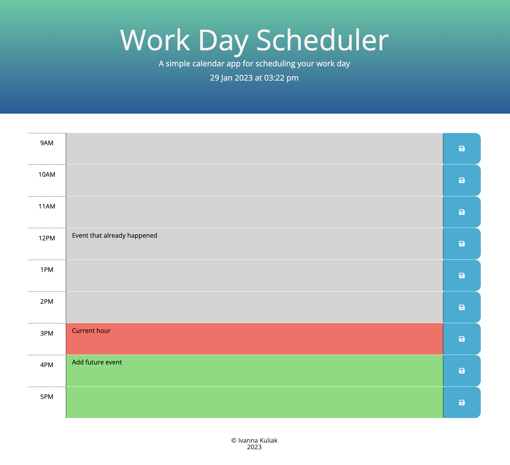

# Your Work Day Scheduler

## Description
JavaScript Calendar application that allows user to save events for standard business hours of the day. In this application the colors of the calendar's timebocks are changing based on the current time - grey color means past time, red for present time and green for future time. Also, all entered events can be saved in the local storage when clicked on save button. 

## Final result

## Installation
"N/A"

## Usage
 1. Follow the link to open deployed application: https://ivanna0803.github.io/your-work-day-scheduler/
 2. Click on the timeblock to enter the event  
 3. Press the blue button to save your event in the local storage 
 4. Refresh the page to check if events are saved

## License
MIT license

